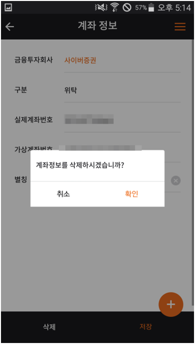

# 오핀\(OFin\) 이용

## 메인 화면

#### \[메인화면\] 로그인 전

로그인 전에는 플랫폼에 등록된 모든 앱 목록이 출력됩니다. 목록 터치 시 상세 화면으로 이동합니다.

**\[메인화면\] 로그인후**

로그인 후에는 신청 완료된 내 앱 목록이 출력됩니다. 

**\[메인화면\] 검색**

키워드 입력 후 키패드의 이동 또는 다음 버튼을 터치하면 검색 결과가 출력됩니다.   
\[X\]버튼 터치 시, 검색 결과 초기화

## 메뉴

**\[메뉴\] 메인 메뉴**

앱 우측 상단 메뉴 버튼 터치 시 메뉴가 활성화됩니다. 메뉴명을 터치하시면 각 화면으로 이동합니다. 

**\[메뉴\] 플로팅 메뉴 \(로그인 전\)**

우측 하단 플로팅 버튼 터치 시, 로그인 화면으로 이동합니다. 

**\[메뉴\] 플로팅 메뉴 \(로그인 후\)**

로그인 후 우측 하단 플로팅 버튼 터치 시, 앱 사용 신청과 계좌관리 화면으로 이동할 수 있는 버튼이 활성화됩니다.

## 회원가입

**\[회원가입\] 회원가입 안내**

로그인 화면에서 \[회원가입\] 버튼을 터치하면 가입에 대한 안내 화면으로 이동합니다. 내용 확인 후 \[가입진행\] 버튼을 터치합니다.

**\[회원가입\] 약관 및 본인인증**

약관에 동의하시면 휴대폰 인증 버튼이 활성화됩니다. 

**\[회원가입\] 휴대폰인증**

정보 입력 후 \[인증번호 전송\] 버튼을 터치하면 SMS로 인증번호가 발송됩니다. 수신된 인증번호 입력 후 \[인증하기\] 버튼을 터치합니다.

## 앱 사용 신청

**\[앱사용신청\] 앱 목록**

목록에서 신청할 앱을 터치합니다.

**\[앱사용신청\] 앱 소개 \(상세\)**

사용 신청 버튼을 터치합니다. 
목록 버튼을 터치하면 앱 목록 화면으로 이동합니다. 

**\[앱사용신청\] 인증서등록 및 정보제공동의**

핀테크 오픈 플랫폼 서비스 신청을 위해서는 공인인증서 등록 및 정보제공동의가 필요합니다. 
\[인증서 등록 및 전자서명\] 영역을 터치합니다. 

**\[앱사용신청\] 연결계좌 선택**

가상계좌 추가가 완료되었습니다. 

선택한 앱에 연결할 가상계좌 선택 후 다음 버튼을 터치합니다.

**\[앱사용신청\] 금융거래정보 제공 동**

선택된 핀테크 기업\(핀테크 앱 개발사\)에 금융거래정보 제공을 위한 동의가 필요합니다.

**\[앱사용신청\] 앱사용신청 완료**

신청이 완료되었습니다. 코스콤과 선택한 핀테크기업에 정보 제공을 허용한 유효기간 동안 서비스 이용이 가능합니다.

**\[앱사용신청\] 메인 \(앱목록\)**

신청이 완료되면 로그인 후 내 앱 목록에 표시됩니다. 

**\[앱사용신청\] 상세**

신청 완료 후 상세 화면에서 연결계좌와 금융거래정보 제공 동의 내용을 조회할 수 있습니다. 계좌 추가가 필요할 경우 \[신청 정보 수정\] 버튼을 터치하면 수정화면으로 이동합니다.

## 계좌관리

**\[계좌관리\] 목록**

등록된 계좌 목록이 출력되며 별칭 또는 계좌번호 영역을 터치하시면 수정 화면으로 이동합니다. 

**\[계좌관리\] 수정**

별칭 수정이 가능합니다. 

**\[계좌관리\] 삭제**

화면 하단 삭제 버튼을 터치하시면 삭제 재확인 후 삭제 처리됩니다. 

## 통합계좌조회

**\[통합계좌조회\] 통합계좌조회 신청 여부 체크**

통합계좌조회 메뉴 터치 시, 신청 여부를 체크하여 신청 전일 경우 메시지를 출력합니다. 확인 버튼 터치 시 신청 화면으로 이동합니다. 

**\[통합계좌조회\] 앱 사용 신청**

앱 신청과 관련된 부분은 [앱 사용 신청 ](https://koscom.gitbook.io/open-api/1/undefined-4/undefined/ofin#undefined-3)부분을 참고하시기 바랍니다. 

**\[통합계좌조회\] 정보제공 권한 허용**

신청 완료 후, 통합계좌조회 메뉴를 터치하면 .정보제공 권한 허용 선택 화면으로 이동합니다. 허용을 선택하시면 통합계좌조회 서비스를 이용할 수 있습니다.

**\[통합계좌조회\] 통합계좌조회**

상단에는 통합계좌조회 서비스에 연결된 계좌의 수와 해당 계좌의 금융투자회사 수가 출력되며 계좌는 등록되었지만 통합계좌조회 서비스에 연결되지 않은 계좌가 있을 경우 추가버튼이 출력됩니다. 
  
검색을 원하는 금융투자회사 또는 가상계좌 선택 후 상단 검색 버튼을 터치합니다.

자산현황/거래내역/포트폴리오/관심종목 모두 원하는 조건 선택 후 검색 버튼을 터치하면 결과가 조회됩니다. 

자산현황과 포트폴리오의 경우 주식/펀드/기타로 구분하여 조회됩니다.

