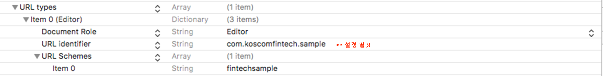

# ios sdk

## 개요

 O'FIN\(오핀\)은 금융투자회사, 유관기관, 핀테크 기업의 데이터와 서비스를 Open API로 게시하고, 상호 융합을 통해 혁신적 비즈니스를 만들 수 있도록 하는 핀테크 오픈 플랫폼입니다. 

본 문서는 API 호출 시 사용자 인증 및 권한을 부여하여 안전하고 표준화된 방법으로 서비스를 제공하기 위한 ‘오핀’ 앱 연동 Oppflib \(SDK\) 사용 설명서입니다.


## 전체 진행 시나리오


## 준비사항

**Library File Import**

라이브러리 사용을 위해 Xcode 에 배포된 라이브러리를 추가합니다. 


**링크 대상에 추가**


## 연동

OPPFFintech가 제공하는 연동 기능을 사용하기 위해서는 Application App은 OPPFAppDelegate을 상속하여 구현해야 합니다.
 또한, 서비스 연동은 Custom URL Scheme을 이용하므로 응답을 수신하기 위해서 App에 Custom URL Scheme을 설정하고 OPPFFintech객체에 등록해야 합니다.

#### **OPPFAppDelegate 상속**

```swift
//OPPFAppDeleage 상속 코드 예
#import <UIKit/UIKit.h>
#import "OPPFAppDelegate.h"

@interface AppDelegate : OPPFAppDelegate<UIApplicationDelegate>
@property (strong, nonatomic) UIWindow *window;

@end
```


#### **Custom URL Scheme을 설정 - info.plist**

info.plist 에 URL types 를 다음과 같이 설정하여 추가  : URL identifier, URL Schemes 은 직접 설정




#### **OPPFFintech객체 생성 및 URL Scheme 등록**

위에서 설정한 URL scheme 정보 등록 

```swift
//URL scheme 정보 등록의 예

#import "ViewController.h"
#import "OPPFFintech.h"

@interface ViewController ()

@end

@implementation ViewController
{
    //OPPFintech 객체 멤버 변수 선언
     OPPFFintech* oppfFintech;
}

- (void)viewDidLoad {
    [super viewDidLoad];
    
    ////OPPFintech 객체 초기화 및 URL Scheme 등록 - “URL schemes://URL identifier”
    oppfFintech = [[OPPFFintech alloc] initWithCallnackUrlScheme:@"fintechsample://com.kscomfintech.sample"]; 
    
   
}
@property (strong, nonatomic) UIWindow *window;

@end
```


#### **API 서비스 정보**

fn 은 해당 업무에 대한 키값 입니다.  
  
data 필드는 해당 업무에 필요한 데이터를 정의 합니다. 각 업무에 필요한 값들을 json object로 전달 합니다.	

**1. 회원 가입 API 호출 \( fn : join \)**

서비스 연동 API의 ‘오핀’ – ‘회원가입 여부를 확인’ 후 결과가 ‘nonmember’인 경우 ‘오핀’ 의 회원가입 페이지 호출

```swift
//Service API 회원 가입 호출 코드 예
NSMutableDictionary* dicData = [[NSMutableDictionary alloc] init];

[oppfFintech requestForResult:@"join"
                         data:(NSDictionary *)dicData
                      success:^(NSString * _Nonnull fn, NSString * _Nonnull message, NSDictionary * _Nonnull data) {
                          
                          NSString* msg = [NSString stringWithFormat:@"message=%@\ndata=%@", message, data];
                          [self printResultText: msg ];
                          
                      } failure:^(NSString * _Nonnull fn, NSString * _Nonnull code, NSString * _Nonnull message) {
                          
                          NSString* msg = [NSString stringWithFormat:@"code=%@\nmessage=%@", code, message];
                          [self printResultText: message];
                          if([code isEqualToString:OPPF_CODE_NOT_INSTALLED]) {
                              // go appstore
                              //[oppfFintech goAppStore];
                          }
                          else {
                              //,,,,,
                          }

                      }];
                          
 }];
```


**회원가입 페이지로 이동**

회원가입 안내  
회원가입 API 호출이 성공하면, 가입에 대한 안내 화면으로 이동합니다. 내용 확인 후 \[가입진행\] 버튼을 터치합니다.


약관 및 본인인증  
약관에 동의하시면 휴대폰 인증 버튼이 활성화됩니다. 


휴대폰 인증  
정보 입력 후 \[인증번호 전송\] 버튼을 터치하면 SMS로 인증번호가 발송됩니다. 수신된 인증번호 입력 후 \[인증하기\] 버튼을 터치합니다. 


**OAuth 로그인창 API 호출 \( fn : oauth \)**

‘오핀’의 OAuth로그인을 통해 사용자 인증을 요청 합니다.
  
responseType 은 안전한 금융거래 정보 보호를 위해 ‘Authorization Code’ 
방식만 제공 합니다.
  
입력 파라메터는 ‘Authorization Code 요청’ 과 동일하며, callbackUrl로 Code값을 전달 합니다.
  
Access token 은 기존 절차에 따릅니다.
 


OAuth 절차는 [이곳](https://koscom.gitbook.io/open-api/~/edit/primary/1/api-1/oauth) 을 참조하세요.




```yaml
{
  "data": {
      "scope": "account",
      "callbackUrl": "https://open.koscom.co.kr/CallbackURL",
      "clientId": "l7xx296eb0af278542b38a6ebd507xxxxxxx",
      "responseType": "code",
      "state": "test"
   }
}
```



해당 API는 사용자 인증을 위한 OAuth 로그인창만 제공하며, Access Token 취득은 기존 URL을 통해 획득 하시면 됩니다.
 인증 성공 \(SUCCESS\), 인증 실패\(FAIL\)는 아래와 같은 에러가 리턴 됩니다.
   
더 자세한 에러 코드 정보는 이곳 에서 확인하세요.

> OAuth 로그인창 Error Code

| **`Error code`** | **`Description`** |
| --- | --- | --- | --- | --- | --- |
| 4000 | 일반적인 에 |
| 4100 | API 및 서비스 이용 권한 획득에 실패한 경우. |
| 4200 | Authorization Code 전달에 실패한 경우 |
| 4300 | 사용자가 요청한 리소스의 권한 허용 거부 |
| 4400 | 비회원 인증 중 이미 가입된 회원
 |


